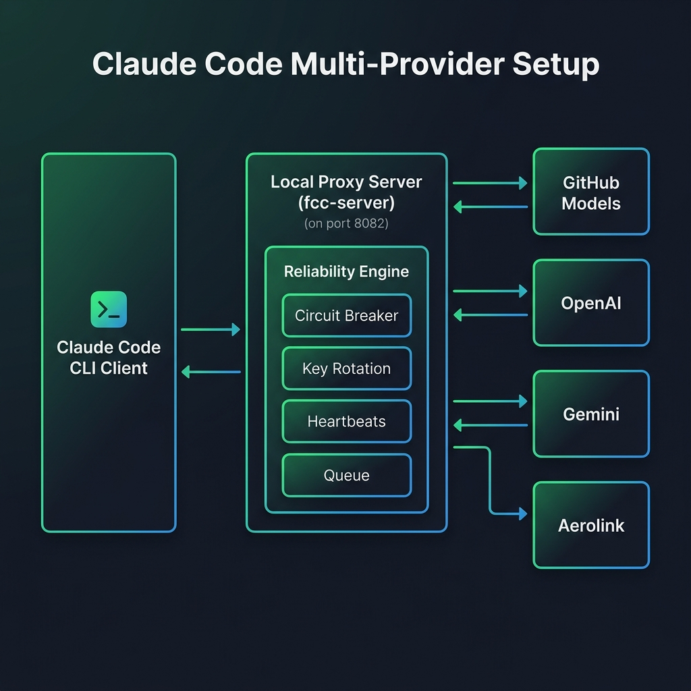

# 🚀 Claude Code Multi-Provider Proxy (`free-claude-code`)

An enterprise-grade, highly reliable local proxy server designed to sit between the **Claude Code CLI Client** and various LLM API providers. It features a rich web-based Admin Panel and a robust Reliability Engine to ensure zero dropped requests, automatic key rotation, and seamless failovers.

---

## 📊 Visual Representation & Architecture



When the Claude Code CLI sends a request, the **Local Proxy Server** intercepts it on port `8082`, passes it through the **Reliability Engine**, and routes it dynamically to your configured providers:
1. **Circuit Breaker**: Detects failing providers and stops sending traffic to them.
2. **Key Rotation & Cooldown**: Rotates API keys automatically; handles `429 RateLimitError` by putting keys on a cooldown timer.
3. **Request Queueing**: Holds incoming requests in an asynchronous queue when all keys/providers are temporarily on cooldown, preventing request drops.
4. **Fallback Cascade**: If a provider fails, the proxy immediately retries the request using the fallback chain (e.g., `aerolink` ➡️ `github_models` ➡️ `groq`).

---

## ✨ Features

- **Web Admin Dashboard (v2.0)**: Live Server Log streaming, dark/light mode, config import/export, profile management, and interactive ping benchmarks.
- **Multi-Key Rotation**: Key pooling with automatic rate limit tracking and key validation.
- **Fallback Cascades**: Chain multiple providers together to ensure 100% uptime.
- **Deduplication**: Collapses identical concurrent request streams to save tokens.
- **Stream Watchdog**: Monitors SSE streams and terminates stalled connections.
- **Local Provider support**: Connects out-of-the-box to Ollama, LM Studio, and llama.cpp.

---

## 🛠️ One-Click Installation

Choose the installation method for your system:

### 🪟 Windows (PowerShell)
Open PowerShell as Administrator and run:
```powershell
Set-ExecutionPolicy Bypass -Scope Process -Force
.\install.ps1
```

### 🍎 macOS / 🐧 Linux (Bash)
Open your terminal and run:
```bash
chmod +x install.sh
./install.sh
```

### 🐳 Docker Compose
If you prefer running the proxy inside a container:
```bash
# 1. Copy env example and configure your keys
cp .env.example .env

# 2. Start container in background
docker compose up -d
```
The server will start listening on port `8082`.

---

## ⚙️ Manual Installation

If you prefer to configure the environment step-by-step:

### Prerequisites
- **Python 3.14.0+**
- **Astral uv** (highly recommended)

### Steps
1. **Clone the repository** and enter the folder:
   ```bash
   git clone https://github.com/ritheshh-cmyk/claudecode.git
   cd claudecode
   ```
2. **Install package dependencies**:
   ```bash
   uv tool install --force --editable .
   ```
3. **Configure environment**:
   ```bash
   mkdir -p ~/.fcc
   cp .env.example ~/.fcc/.env
   # Edit ~/.fcc/.env and insert your API keys
   ```

---

## 🚀 Usage

### 1. Start the Proxy Server
Run the following command to boot the server process:
```bash
fcc-server
```
The server starts listening on `http://127.0.0.1:8082` and automatically opens the **Web Admin UI** in your default browser.

### 2. Configure via Admin UI
Open the control center:
👉 **[http://127.0.0.1:8082/admin](http://127.0.0.1:8082/admin)**
- Set up your primary and fallback models.
- Reorder your fallback providers using the drag-and-drop / arrow widget.
- Monitor log files live in the **Live Logs** console.
- Run latency benchmarks under the **Comparison** tab.

### 3. Launch Claude Code Client
Launch Claude Code using our proxy-configured environment loader:
```bash
fcc-claude
```

---

## 📝 Configuration Parameters

A detailed list of the key configurations inside `.env`:

| Key | Description | Default |
|-----|-------------|---------|
| `MODEL` | Fallback model path (`provider/model-name`) | `nvidia_nim/nvidia/nemotron-3-super-120b-a12b` |
| `FALLBACK_MODEL` | Backup model used for instant retries | `github_models/claude-3-5-sonnet` |
| `FALLBACK_CHAIN` | Comma-separated cascade list | `aerolink,github_models,groq` |
| `PROVIDER_TIMEOUT` | Max seconds to wait for a provider response | `30.0` |
| `HEARTBEAT_INTERVAL` | Ping interval for health checker (seconds) | `60` |
| `BLACKOUT_WINDOWS` | Window when a provider is disabled | `aerolink=02:00-04:00` |
| `ANTHROPIC_AUTH_TOKEN` | Key to protect your local proxy endpoint | `freecc` |

---

## 🤝 Contribution & License

Contributions are welcome! Please open issues or submit pull requests.
Licensed under the MIT License.
